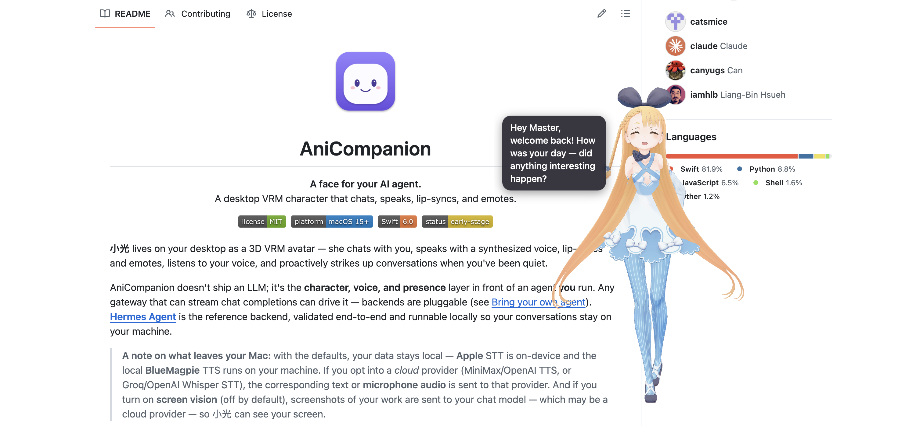

<div align="center">


# AniCompanion

**A face for your AI agent.**<br>
A desktop VRM character for macOS that chats, speaks, listens, lip-syncs, and emotes.


&nbsp;
&nbsp;
&nbsp;

**English** · [繁體中文](README.zh-Hant.md)

</div>

**小光** lives on your desktop as a 3D VRM avatar. She chats with you, **speaks and listens**
(hands-free, and you can talk right over her), lip-syncs, emotes, and starts conversations on her own
after you've been quiet for a while.

AniCompanion doesn't ship an LLM. It's the **character, voice, and presence** layer in front of an
agent **you** run. Anything that streams chat completions can drive it, and the backends are pluggable
([Bring your own agent](#bring-your-own-agent)). The quickest start is a **Claude Code** or **Codex** CLI
you're already signed into; **[Hermes Agent](https://github.com/NousResearch/hermes-agent)** is the
validated reference backend, easy to run locally.

<div align="center">

| English | 繁體中文 |
|:---:|:---:|
|  |  |

</div>

> **Status:** functional, early-stage. Built and tested on macOS 26; runs on macOS 15+. Contributions welcome.

## Features

- **3D VRM character** rendered with [three-vrm](https://github.com/pixiv/three-vrm) (WebGL inside a
  WKWebView), with spring-bone physics for hair and skirt, idle breathing and blinking, and skeletal
  gesture clips.
- **Streaming chat** through a pluggable agent backend, so you can **use the AI you already have:** the
  **Claude Code** or **Codex** CLI you're signed into (no API key), **Hermes Agent** (the validated
  reference), or any **OpenAI-compatible** gateway (Ollama, LM Studio, vLLM, OpenRouter, and so on). A
  **first-run wizard** finds what's installed and sets it up.
- **Talk and be talked to.** She speaks with **amplitude-driven lip sync**, and you reply by voice:
  push-to-talk, **hands-free** (just start talking), or **full-duplex** (cut in mid-sentence). See
  [Voice setup](docs/voice.md).
- **Pluggable voice providers.** For speech, pick **Apple on-device** (the default, no key),
  **MiniMax**, **OpenAI**, or a local **BlueMagpie** server. For listening, pick **Apple on-device**
  (default) or cloud **Whisper** through Groq, OpenAI, or any OpenAI-compatible endpoint.
- **Screen vision** *(opt-in, off by default)*. Let 小光 see your focused window (or the whole screen)
  so she can react to what you're working on. Needs a **vision-capable model** and Screen Recording
  permission.
- **Live captions** *(opt-in, off by default)*. 小光 captions whatever audio is playing on your Mac,
  like a video or a meeting, and can **translate** it on-device as you watch (say, Japanese or Korean
  into Chinese). Captions only; she stays quiet. See [Live captions](docs/live-captions.md).
- **16 emotions.** Emotion tags in the model's replies drive the avatar's facial expressions.
- **Proactive companion.** She greets you at launch and speaks up after a quiet spell.
- **Desktop Pet mode.** Pop 小光 out into a transparent, always-on-top overlay; drag to move her,
  scroll or pinch to resize. See [Desktop Pet mode](#desktop-pet-mode).
- **Multilingual.** Ships in **English** and **Traditional Chinese (繁體中文)**, switchable in Settings.
  The setting covers both the interface *and* the language 小光 speaks.

## What's new in v0.7.0: easy setup, and the AI you already have

You can now **just download and run**. No Xcode, no config files, and a first-run wizard connects 小光
to AI you already have.

- **📦 Download and run, no Xcode needed.** A **signed, notarized `.dmg`** now lives on the
  [Releases](https://github.com/catsmice/AniCompanion/releases) page. Drag 小光 to Applications and open
  it. Full steps in [Download & install](#download--install).
- **🧙 First-run setup wizard.** On first launch, 小光 looks for backends you can use: a logged-in
  **Claude Code** or **Codex**, a running **Hermes**, or **Ollama / LM Studio**. She runs a quick live
  connection test (so an "installed but not logged in" CLI fails *here* rather than mid-chat) and saves
  your choice. Nothing to type. Re-open it anytime from Settings, or from the "No AI model connected"
  prompt.
- **🔌 Use the AI you already have.** Drive 小光 with the **Claude Code** or **Codex** CLI you're already
  signed into. **No API key, no extra service to run.** It runs as a local subprocess, and Settings
  hides the connection fields that don't apply.
- **🎚️ Mic sensitivity.** A new slider lifts the level of quiet speech, so she hears you even when you
  talk softly.

Full history: [CHANGELOG.md](CHANGELOG.md) · [Releases](https://github.com/catsmice/AniCompanion/releases).

## Download & install

Skip the build and grab the ready-to-run app:

1. Download the latest **`AniCompanion-*.dmg`** from the
   [**Releases**](https://github.com/catsmice/AniCompanion/releases) page.
2. Open the `.dmg` and drag **AniCompanion** into **Applications**.
3. Launch it. It's **signed and notarized**, so macOS opens it without a security prompt.

On first launch the **setup wizard** connects 小光 to your AI, such as a **Claude Code** or **Codex**
CLI you're already signed into (see [Bring your own agent](#bring-your-own-agent)). You'll need
**macOS 15+** on Apple Silicon; live captions and on-device translation want macOS 26. Want to build
from source instead? See [Quick start](#quick-start).

## Requirements

*(The prebuilt download needs only macOS 15+ and an [agent to talk to](#bring-your-own-agent).
Everything below is for **building from source**.)*

- **macOS 15.0+** on Apple Silicon to run. *Live captions and on-device translation are best on
  macOS 26*; on macOS 15, some languages fall back to Apple's speech servers and on-device translation
  is unavailable (see [Live captions](docs/live-captions.md)).
- **Xcode 26** to build (the Swift 6 toolchain); the live-caption APIs compile against the macOS 26 SDK.
- **[XcodeGen](https://github.com/yonaskolb/XcodeGen)**, via `brew install xcodegen`.
- An **agent to talk to**: a logged-in **Claude Code** or **Codex** CLI (nothing extra to run), or a
  running gateway such as **[Hermes Agent](#bring-your-own-agent)** (the validated path), Ollama, or
  LM Studio.
- *Voice and vision work with the defaults (on-device, no accounts).* Cloud providers are optional; see
  [Voice setup](docs/voice.md).

## Quick start

```bash
# 1. Generate the Xcode project
xcodegen generate

# 2. Build and run. A default character (小光) is bundled, so it works right away
open AniCompanion.xcodeproj      # then Run (⌘R) in Xcode
# …or: xcodebuild -project AniCompanion.xcodeproj -scheme AniCompanion -destination 'platform=macOS' build
```

On first launch a **setup wizard** scans your Mac for a usable backend: a logged-in **Claude Code** or
**Codex** CLI, a running **Hermes**, or **Ollama / LM Studio**. It connects with nothing for you to
type. You can also enter a cloud API key, or skip the wizard and set things up later under
**Settings (⚙️) → Agent backend** (see [below](#bring-your-own-agent)). Voice runs on Apple's on-device
engines by default; for a cloud voice provider or to tune the voice modes, see
[**Voice setup**](docs/voice.md). Want a different avatar? **Settings → Character** imports your own VRM
or downloads others; see the [VRM model guide](docs/vrm.md).

> **First launch needs internet.** The three-vrm runtime loads from a CDN once, then caches. When it
> works, 小光 appears and greets you. If she never shows up, see [Troubleshooting](#troubleshooting).

## Bring your own agent

AniCompanion talks to an agent you run yourself. Pick one under **Settings → Agent backend**, or let
the first-run wizard set it up:

- **Claude Code** / **Codex**: drive 小光 with the coding CLI you already use. **No API key**; it uses
  your existing login and runs as a local subprocess. The quickest start if you have one installed.
- **Hermes Agent**: the reference backend, validated end to end.
- **OpenAI-compatible**: any gateway that speaks `/v1/chat/completions` SSE, including Ollama, LM
  Studio, vLLM, and OpenRouter.
- **Gemini**: the Gemini CLI (needs a `GEMINI_API_KEY`).

Adding a backend is a one-`case` change; see [`CONTRIBUTING.md`](CONTRIBUTING.md#adding-an-agent-backend-).

Hermes in brief: in `~/.hermes/.env`, set `API_SERVER_ENABLED=true` and `API_SERVER_KEY=<your-key>`
(`openssl rand -hex 32`), run `hermes gateway` (it listens on `http://127.0.0.1:8642`), and put the
same endpoint and key in Settings. Full walkthrough, including optional MCP tools, in
[`docs/hermes-setup.md`](docs/hermes-setup.md).

## Desktop Pet mode

Detach 小光 into a borderless, transparent, always-on-top companion that floats over your other apps.
There's no chat panel in this mode; a small **speech bubble** shows what she's saying. Toggle it with
the **🐾** toolbar button, **Character ▸ Desktop Pet Mode**, or **⌘⇧D**, and **double-click** her to
come back. Drag to move her, scroll or pinch to resize. Your conversation stays put while she's out.

<div align="center">



</div>

## Learn more

- [**Voice setup**](docs/voice.md): TTS and STT providers, hands-free and full-duplex modes, and downloading better voices
- [**Live captions**](docs/live-captions.md): caption and translate the audio playing on your Mac
- [**VRM model guide**](docs/vrm.md): the default model, using your own, and what a model needs
- [**Hermes setup**](docs/hermes-setup.md): the reference agent gateway, MCP tools, and diagnostics
- [**Privacy**](docs/privacy.md): exactly what stays local, and what a cloud option sends
- [**Contributing**](CONTRIBUTING.md): add a backend, a voice provider, or a language
- [**Architecture and developer notes**](CLAUDE.md): how the streaming voice pipeline fits together
- [**Changelog**](CHANGELOG.md)

## Troubleshooting

| Symptom | Likely cause / fix |
|---------|--------------------|
| `xcodegen: command not found` | `brew install xcodegen`. |
| Window opens but the character never appears | First launch needs **internet** (three-vrm loads from a CDN). The default model is bundled; if you switched to a custom model in Settings, confirm that `.vrm` is in `AniCompanion/Resources/VRMModel/`. |
| You type and nothing happens | Your **agent gateway is down or unreachable**. Start it and check the Settings connection indicator. For Hermes, a 401 means the **API Key** doesn't match `API_SERVER_KEY`. |
| She replies in text but stays silent | TTS is off, or her voice sounds robotic. Both are covered in [Voice setup](docs/voice.md). |
| Voice input does nothing | Allow **Microphone** and **Speech Recognition** on first use (System Settings → Privacy & Security). For cloud Whisper, check the endpoint, key, and model. More in [Voice setup](docs/voice.md). |

## License

Application source code is **MIT** (see [`LICENSE`](LICENSE)). Bundled and downloaded **assets** (VRM
models, animation clips) are third-party works under their own terms (see
[`ATTRIBUTION.md`](ATTRIBUTION.md)). The bundled default character (**AvatarSample_A**, VRoid) sits
outside the MIT license: it ships under VRoid's sample-model terms, which permit free redistribution.
The optional **Alicia Solid** model is download-only and is never redistributed by this project.
