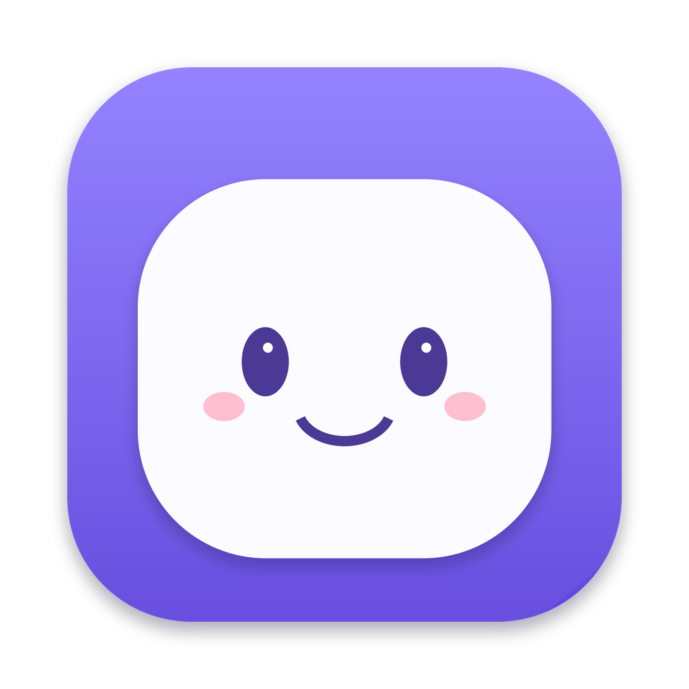
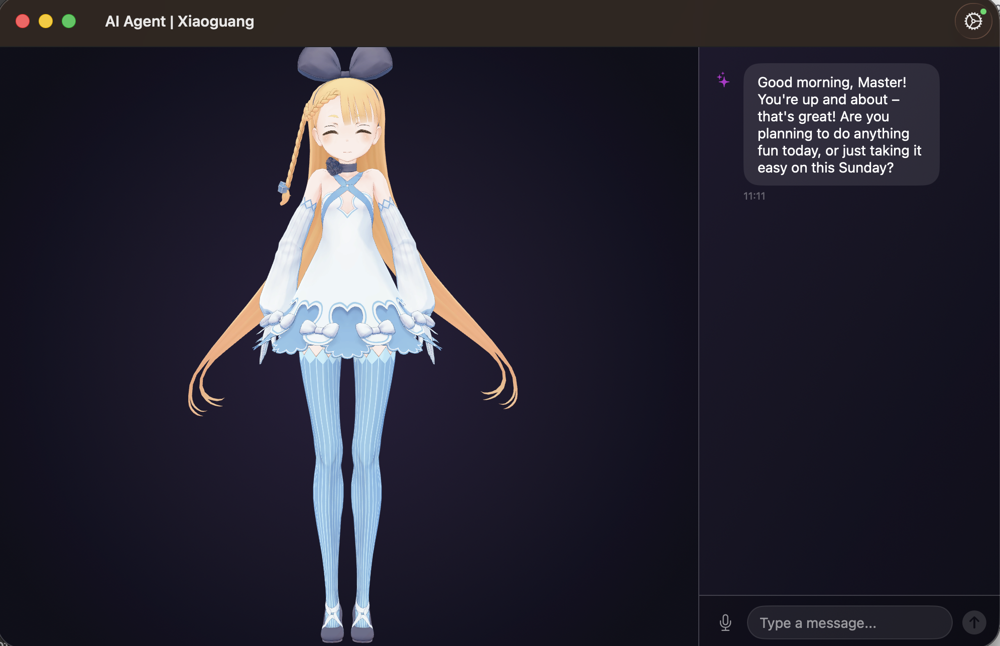
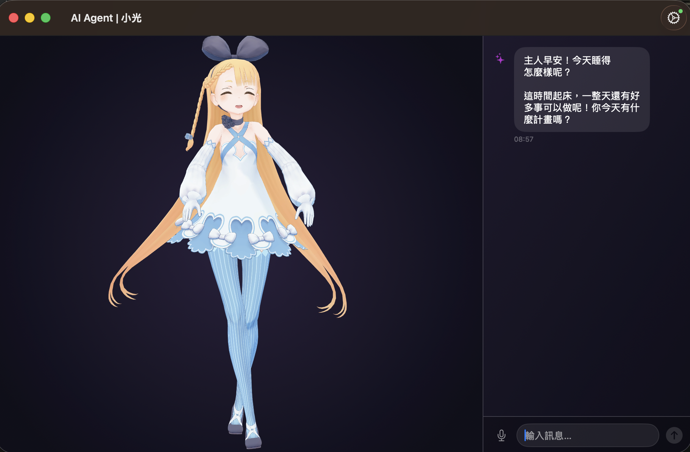

<div align="center">



# AniCompanion

**A face for your AI agent.**<br>
A desktop VRM character that chats, speaks, lip-syncs, and emotes.


&nbsp;
&nbsp;
&nbsp;

</div>

**小光** lives on your desktop as a 3D VRM avatar — she
chats with you, speaks with a synthesized voice, lip-syncs and emotes, listens to your voice,
and proactively strikes up conversations when you've been quiet.

AniCompanion doesn't ship an LLM; it's the **character, voice, and presence** layer in front of an
agent **you** run. Any gateway that can stream chat completions can drive it — backends are
pluggable (see [Bring your own agent](#bring-your-own-agent)).
**[Hermes Agent](https://github.com/NousResearch/hermes-agent)** is the reference backend, validated
end-to-end and runnable locally so your conversations stay on your machine.

| English | 繁體中文 |
|:---:|:---:|
|  |  |

> **Status:** functional, early-stage. Built and tested on macOS 15. Contributions welcome.

## Features

- **3D VRM character** rendered with [three-vrm](https://github.com/pixiv/three-vrm) (WebGL in a
  WKWebView) — spring-bone physics (hair/skirt), idle breathing/blink, skeletal gesture clips.
- **Streaming chat** through a pluggable agent backend. Ships with **Hermes Agent** (the validated
  reference) and a generic **OpenAI-compatible** backend (Ollama, LM Studio, vLLM, OpenRouter, …);
  adding another is a one-`case` change — see [`CONTRIBUTING.md`](CONTRIBUTING.md).
- **Text-to-speech** via MiniMax Speech-02-Turbo or OpenAI Speech API, with
  **amplitude-driven lip sync** — plus an *experimental* local **BlueMagpie-TTS** option
  (pending verification).
- **Speech-to-text** voice input using Apple's on-device Speech framework (auto-stops on silence).
- **Emotions** — 16 emotion tags from the LLM drive the avatar's facial expressions.
- **Proactive companion** — greets you on launch and speaks up after a period of inactivity
  (tool-agnostic: uses your Hermes tools if configured, otherwise just chats).
- **Desktop Pet mode** — detach 小光 into a transparent, always-on-top overlay that lives on your
  desktop; drag to move, scroll/pinch to resize. See [Desktop Pet mode](#desktop-pet-mode).
- **Multilingual** — ships in **English** and **Traditional Chinese (繁體中文)**, switchable in
  Settings (both the interface and the language 小光 speaks). Adding a language is easy — see
  [`CONTRIBUTING.md`](CONTRIBUTING.md).

## What's new in v0.2.0

This release adds:

- **🐾 Desktop Pet mode** — pop 小光 out of her window into a transparent, always-on-top desktop
  overlay you can drag and resize. See [Desktop Pet mode](#desktop-pet-mode).
- **🎙️ Pluggable text-to-speech** — choose your voice provider in **Settings → Voice**: cloud
  **MiniMax**, plus an *experimental* local **BlueMagpie-TTS** option (pending verification — see
  [Local BlueMagpie TTS](#local-bluemagpie-tts)). Contributed by [@hlb](https://github.com/hlb).
- **🧍 Configurable character model** — switch VRM models from **Settings → Character** instead of
  editing source. Contributed by [@hlb](https://github.com/hlb). See [Using your own VRM](#using-your-own-vrm).
- **Clearer language setting** — the Language picker now notes that the **interface** language
  applies after an app restart (the character switches immediately).

## Requirements

- **macOS 15.0+**, Apple Silicon
- **Xcode 16** (Swift 6 toolchain)
- **[XcodeGen](https://github.com/yonaskolb/XcodeGen)** — `brew install xcodegen`
- A running **agent gateway** — a **Hermes Agent** gateway is the validated path (see
  [Bring your own agent](#bring-your-own-agent))
- *(Optional, for voice)* a **MiniMax** or **OpenAI** account for cloud TTS. Without TTS, disable
  voice in Settings and 小光 replies with text + expressions only. *(An experimental local
  **BlueMagpie-TTS** option also exists — see [Local BlueMagpie TTS](#local-bluemagpie-tts).)*

## Quick start

```bash
# 1. Generate the Xcode project
xcodegen generate

# 2. Download the default VRM character model (not bundled — see ATTRIBUTION.md)
./scripts/download-model.sh

# 3. Build & run
open AniCompanion.xcodeproj      # then Run (⌘R) in Xcode
# …or from the command line:
xcodebuild -project AniCompanion.xcodeproj -scheme AniCompanion -destination 'platform=macOS' build
```

On first launch, open **Settings (⚙️)** and fill in:
- **Agent backend** (Hermes by default), its **Endpoint** (default `http://127.0.0.1:8642`) and
  **API Key** — you'll need a gateway **already running** for chat to work (see
  [Bring your own agent](#bring-your-own-agent) below)
- *(optional)* **Voice → TTS Provider**:
  - **MiniMax** — enter your API Key, Group ID, and Voice ID.
  - **OpenAI** — enter your API key, choose a Speech model/voice, and optionally tune
    instructions + speed.
  - **BlueMagpie** *(experimental, pending verification)* — point it at a local BlueMagpie-TTS
    server URL.

> **First launch needs internet** — the three-vrm runtime loads from a CDN the first time, then
> caches. When it's working you'll see 小光 appear in the window and greet you; type in the box (or
> use the mic) and she replies. If the character never appears, check the [Troubleshooting](#troubleshooting)
> notes.

## Bring your own agent

AniCompanion does not ship an LLM — it talks to an agent gateway you run yourself. Two backends are
built in, selectable under **Settings → Agent backend**:

- **Hermes Agent** — the reference backend, validated end-to-end (setup below).
- **OpenAI-compatible** — point it at any gateway speaking `/v1/chat/completions` SSE: Ollama, LM
  Studio, vLLM, OpenRouter, and friends.

Adding another backend is a small, self-contained change — see
*[Adding an agent backend](CONTRIBUTING.md#adding-an-agent-backend-)* in `CONTRIBUTING.md`.

Setting up the Hermes reference backend, briefly:

1. Install Hermes Agent (see its [docs](https://hermes-agent.nousresearch.com)) and configure a
   model provider (e.g. OpenRouter).
2. In `~/.hermes/.env`:
   ```ini
   API_SERVER_ENABLED=true
   API_SERVER_KEY=<a-random-key-you-choose>
   ```
   (generate one with `openssl rand -hex 32`). See [`examples/hermes.env`](examples/hermes.env).
3. Start the gateway:
   ```bash
   hermes gateway          # → listening on http://127.0.0.1:8642
   ```
4. Put the same endpoint + key into the app's Settings.

Full walkthrough, including optional MCP tools for richer proactive behavior, is in
[`docs/hermes-setup.md`](docs/hermes-setup.md).

## OpenAI TTS

Select **Settings → Voice → TTS Provider → OpenAI** to route speech through OpenAI's
`/v1/audio/speech` endpoint. AniCompanion requests WAV output so the existing playback and lip-sync
pipeline can decode it directly.

Available settings:

- **API Key**
- **TTS Model** — defaults to `gpt-4o-mini-tts`
- **Voice** — built-in OpenAI voices such as `coral`, `marin`, or `cedar`
- **Voice Instructions** — promptable style/tone guidance for models that support it
- **Speed** — `0.25x` to `4.0x`

## Local BlueMagpie TTS

Alongside MiniMax, AniCompanion includes an optional **BlueMagpie-TTS** provider — select it under
**Settings → Voice → TTS Provider → BlueMagpie** to route speech to a local
[BlueMagpie-TTS](https://github.com/OpenFormosa/BlueMagpie-TTS) HTTP server (`POST /v1/tts`, WAV).

> ⚠️ **Experimental — not verified end-to-end yet.** The provider and a reference server
> (`Tools/blue_magpie_tts_server.py`) are wired up, but this path is still pending validation against
> BlueMagpie's next release. Until it's confirmed working, use **MiniMax** for voice — full setup
> steps will land here once BlueMagpie is verified.

## Desktop Pet mode

Detach 小光 from her window and let her live **on your desktop** — a borderless, transparent,
always-on-top companion that floats over your other apps. There's no chat panel in pet mode; instead
a small **speech bubble** shows what she's saying (synced to her voice when TTS is on, paced for
reading when it's off).

**Enter pet mode** — any of:

- the **🐾** button in the window's toolbar
- the **Character ▸ Desktop Pet Mode** menu
- the keyboard shortcut **⌘⇧D**

**While she's on the desktop:**

| Action | How |
|--------|-----|
| **Move her** | Click and drag anywhere on her |
| **Resize** | Scroll up/down over her (mouse wheel or two-finger), or pinch on a trackpad — she keeps her proportions, and the size sticks across toggles |
| **Return to the window** | **Double-click** her — or press **⌘⇧D**, or use the 🐾 button / **Character** menu again |

Your conversation is untouched while she's out: returning to the window brings the chat back exactly
as you left it. She floats above other apps and follows you across Spaces, so she's there whatever
you're working on.

## The VRM model

The default character is **Alicia Solid (ニコニ立体ちゃん)**, © DWANGO Co., Ltd. Its license does
**not** permit redistribution, so it is **not bundled** — `scripts/download-model.sh` fetches it for
your own local use. See [`ATTRIBUTION.md`](ATTRIBUTION.md) and
`AniCompanion/Resources/VRMModel/LICENSE-AliciaSolid.md`.

### Using your own VRM

1. Drop your `.vrm` file into `AniCompanion/Resources/VRMModel/`.
2. Open Settings and set **VRM Model Filename** to your file name, for example `YourModel.vrm`.
   (Name the file `AliciaSolid.vrm` and you can skip this step.)
3. Rebuild. If the framing is off for your model's proportions, tune the camera live with the
   `W/S/A/D/Q/E/R/F` keys and set the result as the default in `ThreeVRMRenderView`.

### What the model needs

three-vrm loads both **VRM 0.x and 1.0**, and every VRM is humanoid by spec — so posing, idle
motion, and the skeletal gesture clips work with any valid model. The rest degrades gracefully:

| Feature | Requires | If the model lacks it |
|---------|----------|-----------------------|
| Emotions (16 tags → expressions) | Standard expression presets **happy / angry / sad / relaxed** | Face stays neutral; everything else still works |
| Lip sync | The **`aa`** mouth viseme (optional ARKit / `jawOpen` PerfectSync gives finer motion) | Mouth doesn't move while speaking |
| Idle blink | The **blink** expression preset | No blinking |
| Hair / skirt physics | **Spring bones** | Hair and cloth stay static |

In short: **any humanoid VRM loads and animates**; the standard expression presets plus the `aa`
viseme are what unlock emotions and lip-sync. Richer models (more expressions, PerfectSync) can be
given finer mappings in the three-vrm scene (`Resources/ThreeVRM/vrm_scene.js`).

## How it works

```
You (text or voice) → streaming chat (agent gateway, SSE) → sentence parser → parallel TTS → ordered playback + lip sync
```

The streaming reply is split into sentences as tokens arrive; each sentence is synthesized to
speech in parallel and queued for ordered playback, while audio amplitude drives the avatar's
mouth. Emotion tags in the reply (`[happy]`, `[curious]`, …) switch the avatar's expression.

Architecture details and developer notes are in [`CLAUDE.md`](CLAUDE.md).

## Troubleshooting

| Symptom | Likely cause / fix |
|---------|--------------------|
| `xcodegen: command not found` | `brew install xcodegen` (see [Requirements](#requirements)). |
| The window opens but the character never appears | First launch needs **internet** (the three-vrm runtime loads from a CDN). Also confirm `./scripts/download-model.sh` ran and a `.vrm` exists in `AniCompanion/Resources/VRMModel/`. |
| You type a message and nothing happens | Your **agent gateway isn't running / reachable**. Start it (e.g. `hermes gateway`) and check the connection indicator in Settings. For Hermes, a 401 means the **API Key** in Settings doesn't match `API_SERVER_KEY`. |
| 小光 replies in text but doesn't speak | TTS is off or unconfigured — that's fine. For voice, configure **MiniMax** or **OpenAI** under Settings → Voice, or leave TTS disabled. (BlueMagpie TTS is experimental — see [Local BlueMagpie TTS](#local-bluemagpie-tts).) |
| Voice input does nothing | On first use macOS prompts for **Microphone** and **Speech Recognition** permission — allow both (System Settings → Privacy & Security). |

More runtime diagnostics (health checks, connection states) are in [`docs/hermes-setup.md`](docs/hermes-setup.md).

## License

Application source code: **MIT** — see [`LICENSE`](LICENSE).

Bundled/downloaded **assets** (the VRM model, animation clips) are third-party works under their
own terms — see [`ATTRIBUTION.md`](ATTRIBUTION.md). Notably the default VRM model is **not**
MIT-licensed and is not redistributed by this project.
