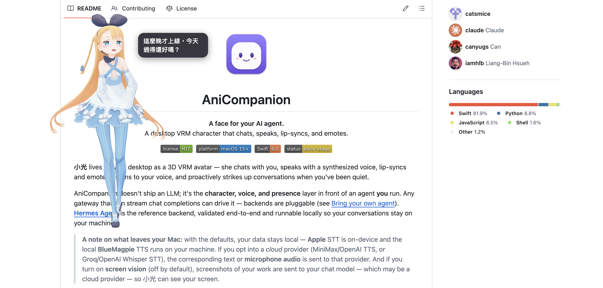

<div align="center">


# AniCompanion

**為你的 AI 代理，賦予一張臉。**<br>
在 macOS 桌面上會聊天、說話、聆聽、對嘴、還會表達情緒的 VRM 虛擬角色。


&nbsp;
&nbsp;
&nbsp;

[English](README.md) · **繁體中文**

</div>

**小光** 以 3D VRM 虛擬角色的形象住在你的桌面上——她會和你聊天、**開口說話也會聆聽**（免持，而且你可以
直接插話打斷她）、對嘴並表達情緒，還會在你安靜一陣子後主動找你說話。

AniCompanion 本身**不含** LLM；它是你自行執行的 agent 前方那一層**角色、聲音與存在感**。任何能串流
chat completions 的 gateway 都能驅動它——後端是可抽換的（見 [自備 agent](#自備-agent)）。
**[Hermes Agent](https://github.com/NousResearch/hermes-agent)** 是經過完整驗證、可在本機執行的參考後端。

<div align="center">

| 英文介面 | 繁體中文介面 |
|:---:|:---:|
|  |  |

</div>

> **狀態：** 可運作、早期階段。於 macOS 15 開發與測試。歡迎貢獻。

## 特色

- **3D VRM 角色**，以 [three-vrm](https://github.com/pixiv/three-vrm)（在 WKWebView 中以 WebGL）渲染——
  彈簧骨骼物理（頭髮／裙擺）、待機呼吸與眨眼、以及骨架手勢動畫。
- **串流聊天**，透過可抽換的 agent 後端：**Hermes Agent**（已驗證的參考後端）或通用的
  **OpenAI 相容**後端（Ollama、LM Studio、vLLM、OpenRouter……）。
- **能說也能被你打斷**——她開口時搭配**由音量驅動的對嘴**，你則用語音回覆：按鍵說話、**免持**（直接說），
  或**全雙工**（說話中直接插話打斷她）。見 [語音設定](docs/voice.md)。
- **可抽換的語音供應商**——TTS：**Apple 裝置端**（預設，免金鑰）、**MiniMax**、**OpenAI**，或本機
  **BlueMagpie**。STT：**Apple 裝置端**（預設）或雲端 **Whisper**（Groq／OpenAI／OpenAI 相容）。
- **螢幕視覺**（*選用，預設關閉*）——讓小光看見你目前的視窗（或整個螢幕），對你正在做的事做出反應。
  需要**支援視覺的模型** ＋ 螢幕錄製權限。
- **16 種情緒**——LLM 輸出的情緒標籤驅動角色的臉部表情。
- **主動陪伴**——啟動時打招呼，並在你安靜一段時間後主動開口。
- **桌面寵物模式**——把小光從視窗中拉出，變成透明、永遠置頂的桌面小夥伴；拖曳移動、捲動／捏合縮放。
  見 [桌面寵物模式](#桌面寵物模式)。
- **多語言**——內建**英文**與**繁體中文**，可在設定中切換（介面*以及*小光說話的語言）。

## v0.5.0 有什麼新功能——語音對語音

和小光說話，她就會**免持**地回話——不必點麥克風，而且你可以像真實對話一樣**用語音直接打斷她**。

- **🍎 Apple 裝置端 TTS——全新預設。** 零設定：免 API 金鑰、免網路、完全私密，開箱即用。（若你偏好，
  雲端 MiniMax／OpenAI 與本機 BlueMagpie 仍在。）小提示：下載一個更高品質的系統語音，音質會大幅提升——
  見 [語音設定 → Apple TTS](docs/voice.md#apple-on-device-default)。
- **🎙️ 免持模式。** 她會持續聆聽並自動回覆——直接說話即可，不必按鈕。
- **🗣️ 全雙工插話**（*選用*）——直接**說話蓋過她**，她就會停下來聆聽，並以回音消除避免聽到自己的聲音。
  （只有在她實際說話時才會接管音訊裝置，因此其餘時間不會靜音其他 App。）

完整紀錄：[CHANGELOG.md](CHANGELOG.md) · [Releases](https://github.com/catsmice/AniCompanion/releases)。

## 系統需求

- **macOS 15.0+**、Apple 晶片
- **Xcode 16**（Swift 6 工具鏈）
- **[XcodeGen](https://github.com/yonaskolb/XcodeGen)**——`brew install xcodegen`
- 執行中的 **agent gateway**——[Hermes Agent](#自備-agent) 是已驗證的路徑
- *語音與視覺使用預設值即可運作（裝置端、免帳號）。* 雲端供應商為選用——見 [語音設定](docs/voice.md)。

## 快速開始

```bash
# 1. 產生 Xcode 專案
xcodegen generate

# 2. 下載預設 VRM 角色模型（未內建——見 ATTRIBUTION.md）
./scripts/download-model.sh

# 3. 建置並執行
open AniCompanion.xcodeproj      # 然後在 Xcode 按 Run（⌘R）
# …或：xcodebuild -project AniCompanion.xcodeproj -scheme AniCompanion -destination 'platform=macOS' build
```

首次啟動時，開啟**設定（⚙️）**並設定你的 **Agent 後端**——它的**端點**（預設
`http://127.0.0.1:8642`）與 **API 金鑰**——指向一個**已在執行**的 gateway（見下方）。語音使用 Apple
裝置端引擎即可開箱運作；若要使用雲端語音供應商或調整語音模式，見 [**語音設定**](docs/voice.md)。

> **首次啟動需要網路**——three-vrm 執行環境會從 CDN 載入一次，之後便快取。運作正常時你會看到小光出現並
> 向你打招呼。若她始終沒出現，見 [疑難排解](#疑難排解)。

## 自備 agent

AniCompanion 會與你自行執行的 agent gateway 溝通。內建兩種後端，位於 **設定 → Agent 後端**：

- **Hermes Agent**——已完整驗證的參考後端。
- **OpenAI 相容**——任何以 `/v1/chat/completions` SSE 溝通的 gateway：Ollama、LM Studio、vLLM、
  OpenRouter 等。

Hermes 簡述——在 `~/.hermes/.env` 設定 `API_SERVER_ENABLED=true` 與 `API_SERVER_KEY=<你的金鑰>`
（可用 `openssl rand -hex 32` 產生），執行 `hermes gateway`（→ `http://127.0.0.1:8642`），再把相同的
端點＋金鑰填入設定。完整教學（含選用的 MCP 工具）：[`docs/hermes-setup.md`](docs/hermes-setup.md)。
新增後端只需改一個 `case`——見 [`CONTRIBUTING.md`](CONTRIBUTING.md#adding-an-agent-backend-)。

## 桌面寵物模式

把小光拉成一個無邊框、透明、永遠置頂、漂浮在其他 App 之上的小夥伴。此模式沒有聊天面板——改以一個小型
**對話泡泡**顯示她正在說的話。用工具列的 **🐾** 按鈕、**角色 ▸ 桌面寵物模式**、或 **⌘⇧D** 切換；
**雙擊**她即可回到視窗。拖曳移動、捲動／捏合縮放。她離開視窗時，你的對話原封不動。

<div align="center">



</div>

## 深入了解

- [**語音設定**](docs/voice.md)——TTS 與 STT 供應商、免持與全雙工模式、下載更好的語音
- [**VRM 模型指南**](docs/vrm.md)——預設模型、使用你自己的模型、模型需要具備什麼
- [**Hermes 設定**](docs/hermes-setup.md)——參考 agent gateway、MCP 工具、診斷
- [**隱私說明**](docs/privacy.md)——哪些留在本機、雲端選項各自會送出什麼
- [**貢獻指南**](CONTRIBUTING.md)——新增後端、語音供應商或語言
- [**架構與開發者筆記**](CLAUDE.md)——串流語音管線如何組合在一起
- [**更新紀錄**](CHANGELOG.md)

## 疑難排解

| 症狀 | 可能原因／解法 |
|------|----------------|
| `xcodegen: command not found` | `brew install xcodegen`。 |
| 視窗開啟但角色始終沒出現 | 首次啟動需要**網路**（three-vrm 從 CDN 載入）；也請確認 `./scripts/download-model.sh` 已執行、且 `AniCompanion/Resources/VRMModel/` 內有 `.vrm`。 |
| 打字後沒有反應 | 你的 **agent gateway 未執行／無法連線**。啟動它並檢查設定中的連線指示。Hermes 出現 401 表示 **API 金鑰**與 `API_SERVER_KEY` 不符。 |
| 她只回文字、不說話 | TTS 關閉，或她的聲音聽起來很機械——兩者都在 [語音設定](docs/voice.md) 說明。 |
| 語音輸入沒反應 | 首次使用時請允許**麥克風** ＋ **語音辨識**（系統設定 → 隱私權與安全性）。雲端 Whisper：檢查端點／金鑰／模型。更多見 [語音設定](docs/voice.md)。 |

## 授權

應用程式原始碼：**MIT**——見 [`LICENSE`](LICENSE)。內建／下載的**素材**（VRM 模型、動畫）為第三方作品，
依其各自條款——見 [`ATTRIBUTION.md`](ATTRIBUTION.md)。預設 VRM 模型**並非** MIT 授權，本專案不會轉散布它。
